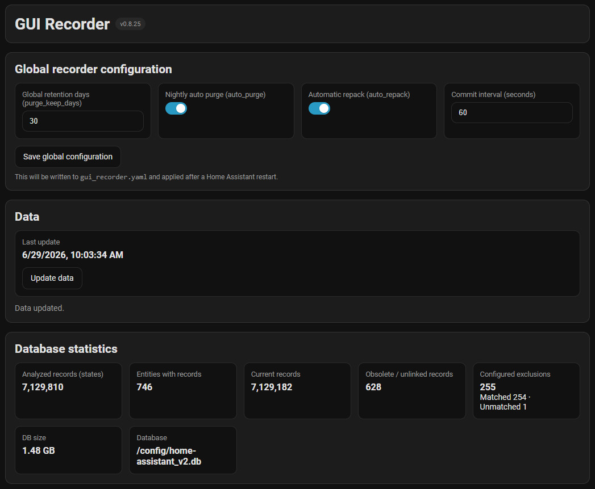
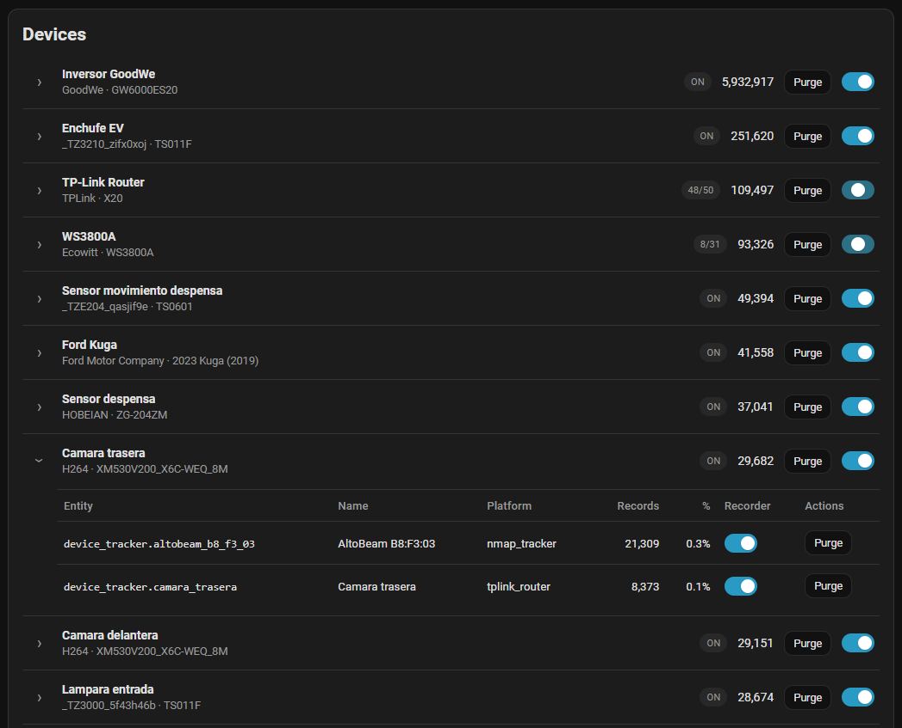
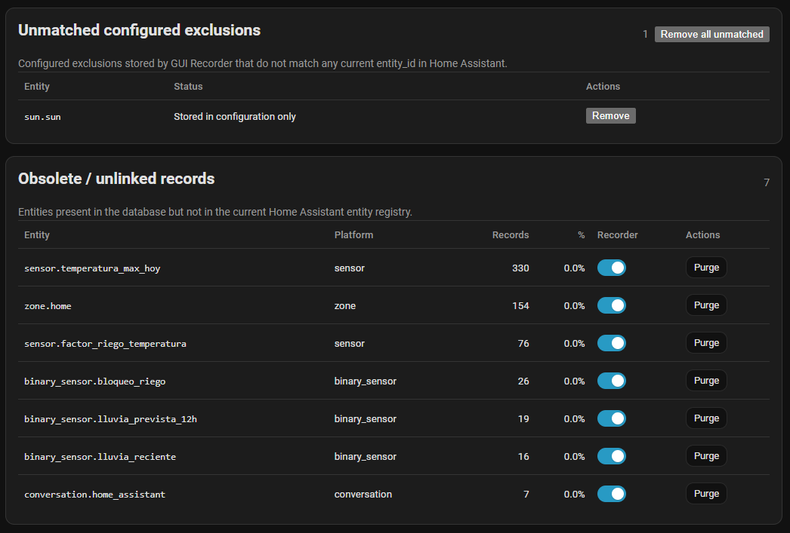

# GUI Recorder

[](https://github.com/hacs/default)
[](https://github.com/ideaalab/gui-recorder/releases)

A Home Assistant custom component that adds a sidebar panel to manage your `recorder` configuration (which entities get recorded) and database maintenance (purge, repack, stats) — without editing `configuration.yaml`.



> **SQLite only.** MariaDB and PostgreSQL are explicitly rejected during setup with a clear error message.

> [!WARNING]
> **Use with care.** Purge operations permanently delete recorder history and cannot be undone. The migration flow modifies `configuration.yaml` directly. Always create a full Home Assistant backup before using maintenance or migration features. The authors take no responsibility for data loss.

## Features

- **Sidebar panel** integrated directly into the Home Assistant navigation bar.
- **Per-device and per-entity control**: enable or disable recording with a toggle — no YAML editing required.
- **Database statistics**: total / current / obsolete records, matched exclusions, disk size (sums `.db` + `.db-wal` + `.db-shm`), SQLite file path.
- **Maintenance actions**:
  - Purge the database (uses global retention setting).
  - Purge excluded entities (full history, ignores retention).
  - Auto-update stats after each purge (optional).
  - Repack after manual purge (optional).
  - Restart Home Assistant.
- **Orphan exclusion detection**: shows entries in `gui_recorder.yaml` that no longer match any entity, with a one-click bulk-remove.
- **Guided migration**: imports your existing `recorder` configuration from `configuration.yaml` in 3 steps (import → disable old block → activate `!include`).
- **Cache busting**: the panel JS is served with `?v=VERSION` to prevent stale versions after updates.

## Screenshots

**Per-device and per-entity control**, with purge actions per row:



**Orphan exclusion detection and obsolete record cleanup**:



## Installation

### Via HACS (recommended)

GUI Recorder is part of the default HACS catalog — no custom repository needed.

1. Open **HACS → Integrations**, search for **GUI Recorder**, and install it.
2. Restart Home Assistant.
3. Go to **Settings → Devices & services → Add integration** and choose **GUI Recorder**.

### Manual

1. Copy `custom_components/gui_recorder/` into `<config>/custom_components/gui_recorder/`.
2. Restart Home Assistant.
3. **Settings → Devices & services → Add integration → GUI Recorder**.

## Usage

After installing and configuring the integration, a **GUI Recorder** panel appears in the sidebar. From there you can:

- Filter entities by `entity_id`, friendly name, domain, or platform.
- Toggle recording for entire devices or individual entities.
- Run database analysis and purges (global, per-device, or per-entity).
- Import your existing `recorder` config from `configuration.yaml`.

The generated configuration is written to `gui_recorder.yaml`, included from `configuration.yaml` via:

```yaml
recorder: !include gui_recorder.yaml
```

The integration writes that file automatically. If you already had a `recorder:` block in `configuration.yaml`, the panel's migration flow guides you through replacing it.

## Uninstalling

Removing the integration doesn't touch your recorder database or delete any data — GUI Recorder only ever reads it. The generated `gui_recorder.yaml` also lives in your config directory, not inside the integration, so it isn't removed either: `recorder: !include gui_recorder.yaml` is plain Home Assistant YAML and keeps working with the integration gone, so your current recording behavior is preserved either way.

To leave `configuration.yaml` clean (recommended), fold `gui_recorder.yaml` back into a plain inline `recorder:` block instead of leaving it pointed at a generated file:

1. Open `gui_recorder.yaml` and copy everything **below** the two `#` comment lines at the top.
2. In `configuration.yaml`, replace:
   ```yaml
   recorder: !include gui_recorder.yaml
   ```
   with `recorder:` followed by that copied content, indented one level underneath, e.g.:
   ```yaml
   recorder:
     auto_purge: true
     auto_repack: true
     purge_keep_days: 10
     commit_interval: 5
     exclude:
       entities:
         - sensor.example
   ```
3. Remove the integration: **Settings → Devices & services → GUI Recorder → Delete**. For a manual install, also delete `custom_components/gui_recorder/`.
4. Restart Home Assistant and confirm everything looks right.
5. Optional cleanup, only after confirming the restart worked: delete `gui_recorder.yaml` and `.storage/gui_recorder.data`. Neither is required — they're harmless if left in place, and `.storage/gui_recorder.data` lets a future reinstall pick up right where you left off.

## Requirements

- Home Assistant **2024.1.0** or later.
- Recorder database on **SQLite** (MariaDB and PostgreSQL are not supported).

## Support

- Issues: https://github.com/ideaalab/gui-recorder/issues

## License

[MIT](LICENSE)
